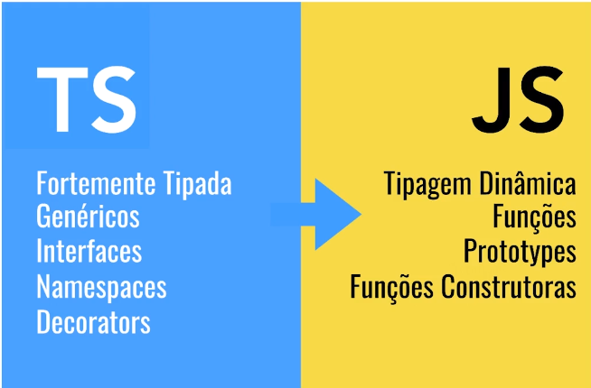
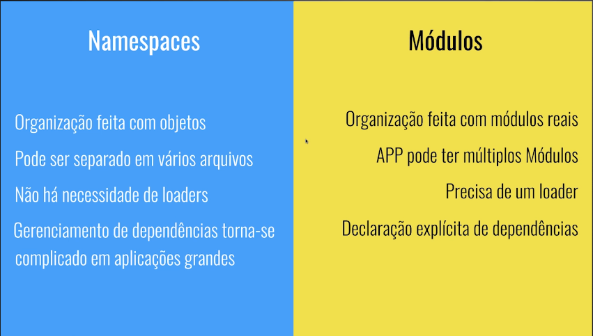

# <p align="center">Typescipt</p> 

# <p align="center">Motivação e diferenças</p>

Podemos considerar o Typescript como um potencializador da linguagem Javascript. Ele permite que grandes sistemas complexos sejam construídos com essa linguagem sem nenhum empecilho e sem que ela deixe a desejar diante de outras linguagens de back-end, como PHP ou Java.

Uma das grandes vantagens é que você pode usar recursos novos, porque o código vai ser copilado pra versão de JS desejada. 

<p align="center"> </p>


# <p align="center">Introdução e Instalação</p>

## Instalação 🪛🔨

Para usuários de Linux cujo a distribuição é o Unbutu, vocês devem ter o [node instalado](https://nodejs.org/en/) e através do npm iremos instalar o typescript através do terminal.

```
sudo npm install i -g typescript
```

Para testar a versão instalada, basta digitar o comando: 

```
tsc --version
```

Para inicializar o arquivo de configuração do typescript, insira o comando: 
```
tsc --init
```

O comando acima, gera um arquivo ```tsconfig.json``` na pasta selecionada, esse arquivo especifica os arquivos raiz e as configurações de compilação necessárias para o projeto em typescript. 

<br><br>

## Compilando o projeto TS manualmente 🧑‍💻⌨️

A forma manual de compilar um arquivo TS e gerar outro arquivo JS correspondente. 

Dado um simples comando em TS em um arquivo chamado ```basico.ts``` : 

```typescript
const a : string = 'Teste TS'
console.log(a)
```

Iremos digitar o seguinte comando no console: 
```
tsc basico.ts
```
O comando irá nos retornar um arquivo chamado ```basico.js``` cujo corpo é: 
```javascript
var a = 'Teste TS';
console.log(a);
```

E então iremos digitar o seguinte comando no terminal: 
```
node basico.js
```

Que ira nos retornar a mensagem ```"Teste TS"``` que inserimos no código TS, ou seja, o comando tsc pegou o código typescript e o transformou em js e então com o comando node, executamos o código .js gerado. 

<br><br>

## Executando o TypeScript através do CodeRunner 🪛🧰
Para executar os arquivos TS, podemos utilizar a extensão do vscode chamada [Code Runner](https://marketplace.visualstudio.com/items?itemName=formulahendry.code-runner). 

Com o code runner instalado, temos que inserir o seguinte comando no terminal para atualizar os pacotes no node. 

```
sudo npm i -g ts-node
```

E então, no arquivo .ts iremos usar a combinação de teclas <kbd>ctrl</kbd>+<kbd>alt</kbd>+<kbd>n</kbd> para executá-lo e caso a extensão tenha sido executada corretamente, o console irá disponibilizar o resultado esperado. 

<br><br>

## Executando o TypeScript no HTML 🧑‍💻🌎
A primeira coisa a se destacar, é que a parte script do HTML irá apontar para o arquivo .js gerado e não para o .ts codificado.

```html
<script src="introducao/basico.js"></script>
```

Para inicializar nosso projeto com relação aos pacotes do node, utilizaremos o seguinte comando no terminal: 
```
npm init -y
```
Que cria um arquivo chamado ```package.json```, que é um arquivo de configuração utilizado para estipular e configurar dependências do nosso projeto (quais outros pacotes ele vai precisar para ser executado) e scripts automatizados. Através dele conseguimos deixar claro uma "receita" para executar um projeto.

E neste caso iremos criar uma dependência referente ao live-server, que nos permite fazer a compilação do typescript de maneira automática e que o browser detecte e nos disponibiliza. 

Para instalar o live-server utilizaremos o seguinte comando no terminal

```
npm i -s live-server
```

Que então nas dependências, irá disponibilizar o seguinte: 
```json
"dependencies": {
    "live-server": "^1.2.2"
  }
```
Informando a dependência live-server e sua versão. 

E então iremos adicionar na parte dos Scripts, o seguinte: 
```json
    "start":"live-server"
```

Que nos permite executar o seguinte comando no Terminal: 
```
npm start 
```

Que irá disponibilizar o contéudo gerado, abrir um servidor referente à página .html criada e me disponibilizar o conteúdo criado. 

Porém, se houver qualquer tipo de modificação no arquivo .ts, o browser não irá detectar por mais que o terminal e o npm aponte a ocorrência dessa mudança, uma alternativa seria mudar o terminal para a pasta onde o arquivo .ts se encontra e executar o comando  ```tsc arquivo.ts``` e depois disso o browser apresentar a mudança mas podemos fazer isso de maneira mais descomplicada, ao utilizar o seguinte comando no terminal:
```
tsc -w
```
Que irá observar todas as mudanças e vai compilar automaticamente sempre que houver uma mudança em qualquer arquivo .ts presente no projeto, o mais interessante,
 é que essa compilação se dá de maneira automática.
 <br><br>

# <p align="center">Usando Tipos</p>
- **Considerações iniciais:** A cada novo tópico será criado uma nova pasta e o arquivo .ts será referenciado na parte de scripts do arquivo ```index.html``` presente neste repositório. 

## Introdução 
O javascript é uma liguagem de tipos dinâmicos, ou seja, ao criar uma variável podemos ter o tipo que quisermos. Já o TypeScript é uma linguagem tipada, assim que uma variável é atribuida a um tipo, ele não admite nenhum outro tipo, portanto o seguinte comando apresentaria erro: 
```typescript
var exemplo = 'varivael_string'; 
nome = 23; 
```
Pois a variável nome já foi atribuida ao tipo String. 

Os tipos são inferidos, por mais que no código você não tenha explicitado o tipo da variável, o typescript irá considerar o tipo do valor a qual a variável foi primeiramente **associada na declaração da mesma**. 

## <p align="center"> Tipos de variáveis </p>
## String
- Uma parte fundamental da criação de programas em JavaScript para páginas da Web e servidores é trabalhar com dados textuais. Como em outras linguagens, usamos o tipo string para fazer referência a esses tipos de dados textuais. Assim como o JavaScript, o TypeScript também usa aspas duplas ("") ou aspas simples (') para cercar os dados da string.
```typescript
var nome = "Gabriel"
```
## Numbers
-  Como no JavaScript, todos os números no TypeScript são valores de ponto flutuante ou BigIntegers. Esses números de ponto flutuante obtêm o tipo ```number```, enquanto os BigIntegers obtêm o tipo ```bigint```.
```typescript
var idade = 25
console.log(idade)
//Irá mostrar 25 no console 
idade = 13.4
console.log(idade)
//Irá mostrar 13.4 no console
```
## Boolean
- O tipo de dados mais básico é o valor verdadeiro/falso simples, que JavaScript e TypeScript chamam de valor ```boolean```.
```typescript
var possuiHobbie = false; 
console.log(possuiHobbie);
//Console irá mostrar false
```

**Observação:** Por mais que o código apresente problema de compilação seja por um erro qualquer, o compilador irá transformá-lo em .js por padrão. Logo, até o momento iremos evitar cometer algum tipo de erro ao codificar. 

## Atribuindo tipos explícitos 
Se ao declarar a variável, eu não atribuir nenhum valor e fazer isso depois, minha variável se torna do tipo ```any```, admitindo qualquer tipo de valor, como segue o exemplo: 

```typescript
let minha_idade 
minha_idade = 27 
console.log(typeof minha_idade)
minha_idade = 'idade 27'
console.log(typeof minha_idade)
```

Para evitar que isso aconteça, devemos explicitar o tipo da variável em sua declaração e esta declaração se dá da seguinte maneira: 

```
let variavel: tipoVariavel
```

## Array 
- TypeScript, como JavaScript, permite trabalhar com arrays de valores. Os tipos de matriz podem ser escritos de duas maneiras. No primeiro, você usa o tipo dos elementos seguido por `[ ]` para denotar uma matriz desse tipo de elemento. 
```typescript
let hobbies: String[] = ["cozinhar", "Jogar", "Programar"]
```
- A segunda maneira usa o tipo genérico de Array, ```Array<tipoElemento>```: 
```typescript
let list: Array<number> = [1, 2, 3];
```

## Tuplas 
- Um tipo de tupla é um tipo de tipo Array que sabe exatamente quantos elementos ele contém e exatamente quais tipos ele contém em posições específicas.
```typescript
type StringNumberPair = [string, number];
```

## Enums 
- O enum é um dos tipos do TypeScript que nos permite declarar um conjunto de valores/constantes pré-definidos.
```typescript
export enum DiaDaSemana {
    Segunda = 1,
    Terca = 2,
    Quarta = 3,
    Quinta = 4,
    Sexta = 5,
    Sabado = 6,
    Domingo = 7,
}
``` 
Quando não definidos, os valores dentro de Enum, aceitam o sequencial a partir do 0, quando alguns estão definidos e outros não, o valor não definido toma o valor do último acrescido de 1 unidade. 

## Any
- O TypeScript possui verificações de tipo e de tempo de compilação. No entanto, nem sempre temos conhecimento prévio sobre o tipo de algumas variáveis, principalmente quando existem valores inseridos pelo usuário de bibliotecas de terceiros. Nesses casos, precisamos de uma disposição que possa lidar com conteúdo dinâmico. O tipo Qualquer é útil aqui.
```ts
let carro: any = 'bmw'
console.log(carro)
carro = {marca:'bmw', ano: 2022}
console.log(carro)
```
## Trabalhando com os tipos nas funções
- As funções são o bloco de construção básico de qualquer aplicativo, sejam funções locais, importadas de outro módulo ou métodos em uma classe. Eles também são valores e, assim como outros valores, o TypeScript tem muitas maneiras de descrever como as funções podem ser chamadas. Vamos aprender sobre como escrever tipos que descrevem funções.

O typescript nos permite inferir qual o tipo de dado que essa função nos retorna. 

```ts
function retornaMeuNome() : String {
    return nome; 
}
// Está explicito na declaração da função que ela nos retornará uma String
```
**Elucidando a sintaxe:** A sintaxe `(a: string) => void` significa “uma função com um parâmetro chamado a, do tipo string, que não tem um valor de retorno (void)”. Assim como a declaração da função, se o tipo de parâmetro não é especificado, é implícito o tipo `any`.

## Usando as funções como tipo 

Dada uma função digaOi previamente determinada: 
```ts
function digaOi(): void{
    console.log("Olá")
}
let comunicar = digaOi 
comunicar()
```

Podemos atribuir à variável comunicar esta função, portanto a variável passa a ser do tipo digaOi. 

```ts
let comunicar = digaOi 
comunicar()
```

Posso usar a seguinte sintaxe caso eu queira inferir que minha função deve ter certos tipos de parâmetros e me retornar algum tipo de valor: 
```ts
let calculo: (a:number, b:number) => number
//A variável cálculo sera associada a apenas uma função que aceita 2 numeros como parametro e retorna um number 
```
## Objetos e tipos 
Na construção de objetos, podemos inferir quais os tipos de dados esperados que serão associados aos seus atributos. 
```ts
let Usuario: {nome: String, idade: number} = { 
    nome: 'João',
    idade: 24
}
//No objeto usuário, seu atributo nome está associado a uma variável do tipo String e a idade ao uma variável do tipo number.
```
## Colocando em prática

```ts
//Criando um objeto chamado funcionário
let funcionario: { 
    //Informo que o objeto funcionario tem um atributo chamado supervisores do tipo array de String
    supervisores: string[], 
    //Informo que o objeto funcionario tem um método chamado baterPonto, que recebe um parâmetro do tipo number chamado horas e nos retorna uma String
    baterPonto: (horas: number) => String
} ={
    //Na construção do objeto, determino que o atributo supervisores recebe 2 Strings
    supervisores: ['Carlos', 'Simone'],
    //Na construção do objeto, explicito como que o método pre-determinado irá se comportar dado um certo valor de entrada
    baterPonto(horario: number): string{
        if(horario<=8)
        {
            return 'normal'
        }
        else{
            return 'fora do horario'
        }
    }
}

//O bloco acima se comporta da seguinte maneira: 
// let variável:{atributo:tipo_atributo, metodo: (nomedavariavel:tipo_variavael)=>tipo_retorno}
// O bloco a frente é onde iremos atribuir valores aos atributos e métodos determinados.
```

## Tipos personalizados com Alias 

Caso quiséssemos criar um novo funcionário com base no código anterior, teríamos que codificar da seguinte maneira: 

```ts
let funcionario2: { 
    supervisores: string[], 
    baterPonto: (horas: number) => String
} ={
    supervisores: ['Bia', 'Carlos'],
    baterPonto(horario: number): string{
        if(horario<=8)
        {
            return 'normal'
        }
        else{
            return 'fora do horario'
        }
    }
}
```

Eu posso criar um tipo chamado funcionário que tem os mesmos parâmetros utilizados nos casos acima:
```ts
type Funcionario ={ 
    supervisores: string[], 
    baterPonto: (horas: number) => String
}
```
E então utilizar esse tipo, similarmente ao que fazemos em uma Classe, **usando a keyword `type`** como um molde para instanciarmos o objeto. 

## Múltiplos tipos com Union Type 

Dado a seguinte situação em que o mesmo dado pode ser apresentado apresentando diversos tipos: 
```ts
var nota = 10
console.log(`Minha nota é ${nota}`)
//Saida no console: Minha nota é 10
var nota = '10'
console.log(`Minha nota é ${nota}`) 
//Saida no console: Minha nota é 10
```
Podemos descrever a variável nota como ``any``, entretanto pode nos ser fornecido um valor booleano, aonde no nosso contexto não faz sentido, tendo em vista o uso de nossa variável, para isso podemos usar a seguinte notação para determinar quais os tipos de variáveis aceitas: 
```ts
var nota: number | String
```
Aonde especificamos quais os tipos serão aceitos pela nossa variável

## Checagem do tipo no Runtime 
Tendo em vista que queremos saber o tipo de um certo valor:
```ts
var valor = 30
```
Por inferência, o compilador considera que o valor acima é do tipo number mas caso desejamos verificar se a variável valor é de fato do tipo number, temos que fazer o seguinte. 
```ts
if(typeof valor=="number")
{
    return "É do tipo number"
}
else{
    return typeof number; 
}
```
No nosso caso, como estamos usando o VSCode, a própria IDE e o TSC nos informa a checagem de tipo, ou seja, no RunTime o VSCode faz a checagem de tipo. 

## 0 tipo never 
Usamos o tipo never, quando queremos dizer explicitamente que a função nunca irá retornar um valor, vejamos um exemplo prático: 

```ts
function falha(msg: string): never{
    throw new Error(msg)
}

const produto = {
    nome : 'Sabão',
    preco: -1, 
    validarProduto(){
        if(!this.nome || this.nome.length==0)
        {
            falha('precisa ter nome')
        }
        if(this.preco<=0)
        {
            falha('Preço inválido')
        }
    }
}
```
<i>No exemplo acima, quando o método validarProduto() ser invocado, será lançado um erro com a mensagem desejada e não será retornado nada, similarmente ao void mas com a diferença que a função falha é uma função explicita que o tipo do retorno não será indefinido. </i>

## Valores opcionais com o tipo Null
Ao declarar uma variável e implicitar o tipo da mesma, torna-se impossível atribuir o tipo null e isso se torna um problema caso queiramos que o valor da variável seja opcional, segue exemplo: 

```ts
var alturaEscada = 20
alturaEscada = null
//O compilador irá informar um erro, pois a variável não aceitará o valor de null tendo em vista que seu tipo é number.
```
Para isto, temos a seguinte delcaração: 
```ts
var alturaEscada: Number | Null
alturaEscada = Null 
```
<br><br>

# <p align="center">Entendendo o compilador TypeScript</p>

## Compilação "persistente" e o "noEmitOnError" 
Dado o seguinte cenário: 
```js
let canal: String = "Casey Neistat"
let inscritos: number = 18923718
canal = inscritos
console.log(canal)
```
Por mais que o código em .ts apresente erro pelo fato da variável canal ser primeiramente associada ao tipo String, o compilador irá apresentar o código em .js normalmente, pois esse erro não existe no javascript. 

Para interromper essa compilação "persistente", adicionamos a seguinte linha no arquivo `tsconfig.json`: 
```json
"noEmitOnError": true,
```

- Essa função infere que por mais que a variável esteja declarada em outro arquivo, o compilador irá considerá-la como uma variável global e não irá admiti-la 

## Alterando a propriedade target (Versão do JS)

Para alterar a versão do JS que o compilador irá converter o código .ts, temos que alterar a propriedade
```json
"target": "VERSÃO"
```

## Debugando com Source Maps 
Com o source maps, conseguimos ter acesso ao arquivo .ts no browser para facilitar a depuração, pois iremos ver o código fonte que irar gerar o código .js interpretado pelo navegador. 

A motivação para se usar o Source Map, é que ao converter o arquivo .ts para .js, existe um tipo de "uglyfy" do código e pode ficar estranho de interpretar e encontrar os possíveis problemas. Para tal, habilitamos a seguinte linha no tsconfig.json:
```json
"sourceMap": true
```

## Evitando o Any implicito 
Para aumentar o nível de complexidade e sempre exigir que o código em TS admita tipos em sua construção, devemos adicionar a seguinte linha de código. 
```json
"noImplicitAny": true
```

## Os parâmetros "strictNullChecks", "noUnusedParameters" e "noUnusedLocals"
- **"strictNullChecks"**: Quando strictNullChecks é false, null e undefined são efetivamente ignorados pela linguagem. Isso pode levar a erros inesperados em tempo de execução, já quando strictNullChecks for true, null e undefined têm seus próprios tipos distintos e você receberá um erro de tipo se tentar usá-los onde um valor concreto é esperado.

- **"noUnusedParameters" e "noUnusedLocals"**: Dado uma declaração qualquer, caso essa variável não seja usada, o sistema irá reclamar que a variável declarada não é usada. 

## Alterando o diretório de saída dos arquivos .js 
Para uma melhor organização e caso seja desejável, podemos alterar a linha: 
```json 
"outDir": "./"
```
Que irá armazenar os arquivos .js em uma pasta específica

## Alterando o arquivo de saída 
Podemos gerar um arquivo para toda a compilação, que é o seguinte: 
```json
"outFile":"./"
```

<br><br>

# <p align="center">Usando Classes para criar objetos</p>

## Classes e Atributos 
O TypeScript oferece suporte completo para a palavra-chave class introduzida no ES2015, assim como outros recursos da linguagem JavaScript, o TypeScript adiciona anotações de tipo e outras sintaxes para permitir que você expresse relacionamentos entre classes e outros tipos.

Partindo do princípio em que você é familiarizado com a Orientação à objetos e o tratamento de classes, a construção de classes no TS não é muito diferente, conforme o seguinte: 

```ts
    class nomeClasse{
        atributo: tipoAtributo

        constructor(atributro: tipoAtributo){
            this.atributo = atributo
        }
    }
```
Para instanciar uma classe, faz-se o seguinte: 
```ts
const instancia = new nomeClasse(atributo); 
```
<i>Veja o quão semelhante a construção e instanciamento de classes no TS em comparação à outras linguagens de programação.</i>

### ❗Classes por padrão são public. ❗

Uma vez que no construtor, inferimos o valor dos atributos desejados, ao instanciar a classe não precisamos declarar todos os atributos, conforme segue o exemplo: 
```ts
    class nomeClasse{
        atributo: tipoAtributo

        constructor(atributro: tipoAtributo = valor){
            this.atributo = atributo
        }
    }

    //Ao instanciar a classe não temos que informar o valor do atributo 
    const instancia = new nomeClasse//Podendo omitir os ();
```

Maaaaaas.... Existe **Outra maneira de se criar uma classe**:

```ts
    class nomeClasse{
        constructor(public atributo: tipoAtributo){

        }
    }
```
<i>
Ao declarar no construtor que o atributo da classe construida é public, automaticamente esse atributo passa a fazer parte da classe, dispensando a declaração de atributos antes do método construtor.
</i>

<br>

## Métodos de classes 
Uma propriedade de função em uma classe é chamada de método, métodos podem ser usados com a mesma anotação que funções e construtores.

Dada a seguinte necessidade de executar uma apresentação da minha classe, temos que fazer um método que retorna o desejado. 

```ts
    class nomeClasse{
        constructor(public atributo: tipoAtributo){

        }
    }

    apresenta(): String{ 
        return `O valor do atributo é: ${this.atributo}`
    }
```
E vale ressaltar que dentro desses métodos podemos colocar o que quisermos, condicionais, loops de repetições e etc. 

## Modificadores de Acesso 
 Na declaração dos atributos de uma classe, por padrão os mesmos irão receber por padrão a propriedade de visibilidade `public`, ou seja, elas são públicas e podem ser acessadas e alteradas tanto dentro da classe ou fora dela, não tendo um escopo de “segurança”.  

 Para termos um certo controle sobre o acesso das propriedades das classes, temos os chamados modificadores de acesso, que são: 

 `private:` Onde a propriedade pode ser acessada somente pela própria classe. 

 ```ts
 class Pessoa{
	private nome: string = "TreinaWeb";
	idade: number = 12
	estaVivo: boolean = true;
}

let pessoa = new Pessoa();
pessoa.nome = "Paulo"; //Utilizando private não podemos mais acessar desta forma
```

`protected:` Onde a propriedade pode ser acessada pela mesma classe e classes filhas mas não pode ser acessada por outras classes.

```ts
class Pessoa{
	nome: string;
	idade: number;
	protected estaVivo: boolean;

	constructor(nome: string, idade: number, estaVivo: boolean){
    	this.nome = nome;
    	this.idade = idade;
    	this.estaVivo = estaVivo;
	}
}

class PessoaFisica extends Pessoa{
  cnpj: number;

  constructor(nome: string, idade: number, estaVivo: boolean, cnpj: number){
	super(nome, idade, estaVivo); //ao utilizar protected, podemos acessar por classes
	this.cnpj = cnpj;             //filhas e pela própria classe;
  }
}
```

`readonly:`Propriedade pode ser acessada fora da classe, mas não é possível alterar o seu valor. 

```ts
class Pessoa{
	nome: string = "TreinaWeb";
	idade: number = 12
	readonly estaVivo: boolean = true;
}

let pessoa = new Pessoa();
console.log(pessoa.estaVivo); //a propriedade estaVivo será exibida com sucesso.
pessoa.estaVivo = false; //Mas não podemos alterar essa propriedade.
```

## Herança 
A palavra-chave `class`, introduzida no ECMAScript 2015, nos permite definir uma classe em JavaScript. O TypeScript também tem suporte ao paradigma. Um dos elementos da programação orientada à objetos é a herança de classes para reutilizar o código. No JavaScript tradicional, a herança é feita através de protótipos. Já com a palavra-chave class, podemos fazer a herança através da palavra-chave `extends`.

O que foi dito acima é bastante normal para quem já está habituado com a orientação à objetos mas veja como é feito no código typescript.

```ts 
class Carro{ 
    private velocidadeAtual: number = 0

    constructor(public marca: string, public modelo: string, private velocidadeMaxima: number=200){
        
    }
    private alterarVelocidade(delta:number) : number
    {
        const novaVelo = this.velocidadeAtual +delta; 
        const velocidadeValida = novaVelo >=0 && novaVelo <=this.velocidadeMaxima
    
        if(velocidadeValida){
            this.velocidadeAtual = novaVelo
        }
        else { 
            this.velocidadeAtual = delta > 0 ? this.velocidadeMaxima : 0
        }

        return this.velocidadeAtual
    }

    public acelerar (): number {
        return this.alterarVelocidade(5)
    }

    public frear(): number{
        return this.alterarVelocidade(-5)
    }
}
```
<i>Dado uma classe qualquer com seus respectivos atributos, desejamos coletar suas propriedades e extender à uma outra classe</i>

```ts
class HyperCarro extends Carro{

}
```
<i>Neste momento, eu não preciso replicar todo o código criado em carro</i>

```ts 
const huayra = new HyperCarro('Pagani', 'Huayra', 350);
```
<i>A classe acima que foi instanciada, herdou todas as propriedades (métodos e atributos)</i>

- Agora, classes que estendem outras classes, podem sobrescrever os métodos assinalados pelas classes pais desde que os métodos de acesso sejam coerentes com o uso, no caso de nossa classe carro, o método `private alterarVelocidade` receberia a assinatura `protected`. 
- Equanto estivermos na classe filha e quisermos executar o construtor da classe pai, deveremos chamar o método `super` e executá-lo, segue o exemplo: 
```ts
    constructor(marca: String, velocidademaxima: number){
        super('Pagani', marca, velocidadeMaxima)
    }
```
<i>Estamos sobrescrevendo o método construtor, podendo passar apenas 2 propriedades e a O.O. irá considerar o nome da marca como a inferida após o super.</i>


## Getters & Setters 
Para alterar atributos que possuém modificadores de acesso do tipo `private`, usamos os métodos `getters` e `setters` assim como em outros paradigmas O.O., porém a notação em typescript é bem diferente do que estamos acostumados. 

```ts
    class Pessoa{ 
        private _idade; 
        //usamos a notação com _ antes do nome do atributo para inferir que o dado informado é do tipo private. 

        get idade(): number{ 
            return this._idade;
        }

        set idade(idade: number){
            this._idade = idade
        }
    }
```
<i> Para nós que estamos acostumados com alguns outros paradigmas de programação, o comum seria `getIdade` e `setIdade` mas veja que a sintaxe aqui em TS é diferente porém o princípio é o mesmo. </i>

E o acesso aos métodos é feito da seguinte maneira: 

```ts
const pessoa1 = new Pessoa (); 
pessoa1.idade = 25; 
//Por mais que pareça que estamos acessando o atributo diretamente, estamos acessando o método set do mesmo.
```

## Membros estáticos 
Atributos e métodos estáticos significam que os mesmos pertecem à classe e não à instância. 

De uma forma tradicional, temos a seguinte Classe: 

```ts
class Matematica{
    PI: number = 3.141516


    areaCirc(raio: number): number{ 
        return this.PI * raio * raio
    }
}

const m1 = new Matematica(); 
console.log(m1.areaCirc(4));
```
- Caso seja necessário calcular n áreas dos círculos desejados, temos de instanciar n objetos referentes à classe, portanto podemos atribuir ao método `areaCirc` e ao atributo `PI` o identificador static, onde os métodos e atributos pertencerão a classe e não à instância. Portanto,a classe acima se torna a seguinte: 
```ts
class Matematica{
    static PI: number = 3.141516


    static areaCirc(raio: number): number{ 
        return this.PI * raio * raio
    }
}

raio = n //Valor n qualquer
Matematica.areaCirc(raio) // Calcula a área com o raio sem precisar de instanciar a classe de Matematica 
```
## Classe abstrata 
A classe abstrata enumera características genéricas do modelo, mas não as implementa. A classe abstrata obriga subclasses a implementarem funcionalidades abstratas previstas em seu corpo. Para isto, cada subclasse se utiliza de seus detalhes particulares.

Tudo o que definimos até então, foi passado em classes concretas, a classe abstrata é um conceito que não é existente no JS mas foi trago ao TS. 

```ts
abstract class X { 
    y(a: number) number{

    }
}
```
<i>A classe abstrata `X` possuí um método `y` que tem como parâmetro um número `a` e retorna um `number`. Caso uma outra classe qualquer herde a classe `X`, ela obrigatóriamente irá herdar o método `y`</i>

## Construtor privado e Singleton 
Uma outra possibilidade, é a implementação de padrão de projeto chamada Singleton, onde é um controle de como você instancia um determinado projeto, transformando um construtor privado. 

Como o nome indica, uma classe é considerada singleton se ela limitar o número de objetos dessa classe a um. Ou seja, não podemos ter mais de um único objeto para essas classes.

<br><br>

# <p align="center">Módulos e Namespaces</p>

## Namespaces
Os Namespaces são uma forma específica do TypeScript para organizar código. Namespaces são simplesmente objetos JavaScript nomeados no namespace global. Isso torna os namespaces uma construção muito simples de usar. 

Veja o exemplo a seguir: 
```ts
const PI = 3.14 

function areaCircunferencia(raio:number): number{
    return PI*Math.pow(raio,2)
}

function areaRetangulo(base: number, altura:number):number{
    return base * altura
}

console.log(areaCircunferencia(10))
console.log(areaRetangulo(10,5))
```

Existe uma maneira de simplificar o código acima, onde podemos organizar a esquematização acima da seguinte maneira: 
```ts
namespace Areas{
    const PI = 3.14 

    export function Circunferencia(raio:number): number{
    //Usamos o export para dizemos que a função no namespacing pode ser exportada    
        return PI*Math.pow(raio,2)
    }
    
    export function Retangulo(base: number, altura:number):number{
        return base * altura
    }
}

console.log(Areas.Circunferencia(10))
console.log(Areas.Retangulo(10,5))
```

Onde inserimos todo o código em um lugar reservado, podendo até alterar as constantes fora do contexto sem alterar o valor dentro no namespacing. 

- Caso haja a necessidade, podemos escrever os namespaces de **maneira aninhada**, caso queiramos aninhar o conteúdo do código acima de maneira que tenhamos as funções relativas à geometria. 

```ts
namespace Geometria{
    
    export namespace Areas{
    //Lembrando de usar o export
    const PI = 3.14 

    export function Circunferencia(raio:number): number{
    //Usamos o export para dizemos que a função no namespacing pode ser exportada    
        return PI*Math.pow(raio,2)
    }
    
    export function Retangulo(base: number, altura:number):number{
        return base * altura
    }
    }
}

console.log(Geometria.Areas.Circunferencia(10))
console.log(Geometria.Areas.Retangulo(10,5))
```

## Namespaces em múltiplos arquivos 
Caso seja necessário fazer a separação dos arquivos dos namespaces, usamos o `tsc` para compilar em só um código: 
```
tsc -w --outFile arquivoreferenciado.js arquivoasercompilado.ts outroarquivo.ts
``` 
## Referenciando os arquivos 
Outra maneira de referenciarmos os arquivos sem utilizar o `tsc -w --outFile` é através da seguinte linha de código: 

```ts
///<reference path="geometriaRet.ts"/>
```

E no console referenciando apenas o arquivo principal 

```
tsc -w --outFile arquivoreferenciado.js arquivoasercompilado.ts 
``` 

## Módulos 
Módulos por padrão não são interpretados pelos navegadores, no backend é comum o uso de módulos porém podemos usar no typescript 

**Módulos podem conter código e declarações.**

Os módulos também dependem de um carregador de módulos (como CommonJs/Require.js) ou um ambiente que suporta módulos ES. Módulos fornecem melhor reutilização de código, isolamento mais forte e melhor suporte a ferramentas para empacotamento. Também é importante notar que, para aplicações Node.js, moódulos são o padrão e nós recomendamos módulos em vez de namespaces em códigos modernos.

- Para a importação de módulos, utilizamos a seguinte linha de comando no código: 
```ts
import {metodoImportado} from "./arquivo";
```
O código não irá apresentar nenhum problema no ponto de vista do TS porém quando convertido para JS apresentará problema pois o mesmo não oferece suporte para módulos. 

Agora, pra fazer os módulos rodarem corretamente nos browsers, devemos usar o **SystemJS** 
<p>

- Para instalar o SystemJS devemos instalar seguinte o módulo do node: 

```
npm i -s systemjs@0.21.5
```
- Além de instalar, o node já cita o systemjs nas dependências 
</p>

Usando o comando `default` após a declaração de `export` faz com que a declaração da importação seja diferente. 

```ts
import metodoImportado from "./caminho";
```

<p align="center"> </p>

<br><br>

# <p align="center">Interfaces</p>

Interfaces, nas palavras mais simples, descrevem a estrutura do objeto, o que significa que descreve como o objeto deve se parecer. Dentro TypeScript, podemos trabalhar com “Interfaces”. No TypeScript, uma interface contém apenas a definição de métodos e propriedades, não sua implementação. É a funcionalidade da classe que realiza a conexão entre a interface fornecendo a conexão com todos os parâmetros da interface.

A interface é um recurso muito utilizado em Java, bem como na maioria das linguagens orientadas a objeto, para “obrigar” a um determinado grupo de classes a ter métodos ou propriedades em comum para existir em um determinado contexto, contudo os métodos podem ser implementados em cada classe de uma maneira diferente. Pode-se dizer, a grosso modo, que uma interface é um contrato que quando assumido por uma classe deve ser implementado.

## Aplicação de Interface em typescript: 
```ts
interface humano{
    nome: string //Atributo obrigatório
    idade?: number // Atributo opcional
    [prop: string]: any //Atributo variável porém obrigatório

    saudar(sobrenome: string):void //Método obrigatório
}
```
<i>A classe que implementar a interface acima, consequentemente tem que implementar os métodos e atributos sinalizados.</i>

## Implementação de interface em Classes 

A implementação de interfaces nas classes criadas em typescript são muito semelhantes as que são criadas em Java e outras linguagens orientadas a objetos, é simples e utilizando a palavra `extends`.
```ts
class Usuario implements humano{
    nome: string = ''
    idade?: number | undefined
    saudar(sobrenome: string): void {
        console.log('Ola meu nome é ' + this.nome + sobrenome)
    }    
}
```

## Interfaces do tipo função 
Podemos implementar uma interface em que o seu contrato com quem for implementar, sejam funções, conforme segue o exemplo: 

```ts
interface implementaCalculo{
    (a: number, b:number): number
}
```
<i>Qualquer tipo de propriedade (classe, tipo, etc) que implementar a interface acima tem que por obrigação ter um método em que a entrada são duas variáveis do tipo `number` e retorna um `number`</i>

## Herança e Interfaces 

Podemos aplicar o conceito de herança com interfaces também, sendo sua notação a seguinte: 

```ts
interface A {
    a(): void 
}

interface B{
    b(): void
}

interface ABC extends A, B{ 
    c(): void 
}

class RealA implements A{
    a(): void {}
}

class RealAB implements A,B {
    a(): void {}
    b(): void {}
}

class realABC implements ABC{
    c(): void {}
    a(): void {}
    b(): void {}
}
```

# <p align="center">Generics</p>

Uma parte importante da engenharia de software é construir componentes que não apenas tenham APIs bem definidas e consistentes, mas também sejam reutilizáveis. Componentes que são capazes de trabalhar com os dados de hoje e com os dados de amanhã fornecerão os recursos mais flexíveis para construir grandes sistemas de software.

Em linguagens como C# e Java, uma das principais ferramentas da caixa de ferramentas para criar componentes reutilizáveis ​​são os genéricos, ou seja, poder criar um componente que pode funcionar em vários tipos ao invés de um único. Isso permite que os usuários consumam esses componentes e usem seus próprios tipos.

Para trabalhar com tipos genéricos em funções no typescript, utilizamos a seguinte notação: 
```ts
function nomeFuncao<T>(objeto: T): T{
    return objeto
}
//A função nomeFuncao recebe entre <> a letra T que indica que heverá um certo tipo de objeto que será trabalhado, esse tipo T será parâmetro de entrada e tipo de saída também.
```

Aplicando os genéricos: 

```ts
function echo<T>(objeto: T): T{
    return objeto
}
console.log(echo('Gabriel').length)
console.log(echo(18).lenght)
// O sistema irá reclamar pois identifica que a propriedade lenght não existe para o tipo number
```

Seja a partir da inferência: 
```ts
echo('Gabriel').lenght //Inferindo que o tipo é uma string
```

Ou seja a partir da notação do próprio generics: 
```ts
echo<number>(21)//Na notação informo que a função receberá um tipo number
```

**Nota:** A notação generics vem muito mais de quem está construindo algo que é genérico, que em algum momento irá ser especificado o tipo. 

Exemplos de criações com generics: 
```ts
function imprimir<T>(args: T[]){
    args.forEach(elemento => console.log(elemento))
}

imprimir([1,2,3])
imprimir<number>([1,2,3])
imprimir<string>(['Gabriel','Felipe','Joao'])

type Aluno = {nome: string, idade: number}
imprimir<Aluno>([
    {nome: 'Fulano', idade: 22},
    {nome: 'Cicrano', idade: 25}
])
```

## Criando classes com Generics 

Outro uso importante de Generics é associar o seu uso com classes.

Tendo em vista o seguinte problema: 
```ts
class OperacaoBinaria{
    constructor(public operando1: any, public operando2: any){

        }
    executar (){
        return this.operando1 + this.operando2
    }
}
console.log(new OperacaoBinaria('Bom ', 'Dia').executar())
//Console mostra: Bom Dia
console.log(new OperacaoBinaria({},{}).executar())
//Console mostra:[object Object][object Object]
```
<i>Se nota que a construção da classe é feita de maneira genérica pois utiliza do tipo any e isso pode gerar algum tipo de problema pois na segunda operação onde construimos a classe com 2 objetos, o método os transforma para string e os concatena e isso obviamente não é o que queremos</i>


Para solucionar o problema acima, devemos transformar a classe `OperacaoBinaria` em uma **classe abstrata** e então extendê-la da maneira que precisarmos: 
```ts
abstract class OperacaoBinaria<T, R>{ //Indicamos que a classe terá 2 tipos genéricos.
    constructor(public operando1: T, public operando2: T){//Seu construtor indicando que a classe que extender terá 2 atributos do tipo T

        }
    abstract executar (): R // O método executar deve retornar o objeto do tipo R
}

class SomaBinaria extends OperacaoBinaria<number, number>{
//A classe SomaBinaria herda a classe abstrata OperacaoBinaria e em sua declaração, inferimos que os tipos serão number e number
    executar(): number {
        return this.operando1 + this.operando2
        //O método executar retorna um tipo R cujo valor é a soma dos dois operandos. 
    }  
}
```